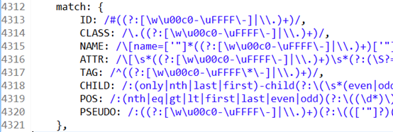

# 第3章：jQuery基本语法

## 3.1 jQuery源码初分析

```javascript
(function( window, undefined ) {	//16行
	
	var jQuery = (function() {	//22行
	
		var jQuery = function( selector, context ) { //25行
			// The jQuery object is actually just the init constructor 'enhanced'
			return new jQuery.fn.init( selector, context, rootjQuery );
		};
		
		jQuery.fn = jQuery.prototype = {	//97行
			constructor: jQuery,
			init: function( selector, context, rootjQuery ) {
				//...
			}	//207行
			
		};	//319行
	
		//...
		return jQuery;	//981行

	})();	//983行
	
// Expose jQuery to the global object
window.jQuery = window.$ = jQuery;	//9384行
	
})( window );	//9404行

```

说明：

- 自执行函数
- 给window添加了两个等同的函数： jQuery() / $()
- 执行$()后，返回的是一个jQuery库包装的对象， 一般称之为：jQuery对象

## 3.2 jQuery核心函数： $()

- jQuery库中为window对象定义了一个函数： jQuery()，简化为：$()。注意：jQuery也是区分大小写的。
- $是jQuery的核心函数，**jQuery的核心功能都是通过这个函数实现。**$()就是调用$这个函数。
- $函数会根据参数数据类型的不同做不同的工作, 返回一个jQuery封装的伪数组的对象
- **核心函数有如下的四个作用：**

### 3.2.1 传入参数为函数时：$(function(){})

- 传入一个function参数, 作为回调函数。相当于window.onload = function(){}

- 表示：在DOM文档载入完成后，回调函数自动执行

- 这个函数是 $(document).ready(function(){})的简写形式。（见jQuery文档 - 事件 - 页面载入）

  ```javascript
  //简洁语法
  $(function(){
     alert("jQuery2");
  })
  //标准语法
  $(document).ready(function(){
     alert("jQuery3");
  });
  ```

  

- 它与window.onload是有区别的


- 源码聚焦


### 3.2.2 传入参数为选择器字符串时： $(选择器字符串)

- 接收一个CSS选择器格式的字符串参数

- 根据这个选择器查找元素节点对象

- 根据此字符串在document中去匹配一组元素，并封装成jQuery对象返回

- 举例：

  ```js
  $("#id属性值"); 相当于通过id属性查找标签对象
  $("标签名");  相当于通过标签名查找标签对象，返回集合
  $(".class属性值");  相当于通过class属性查找标签对象，返回集合
  ```

- 源码聚焦





### 3.2.3 传入参数为HTML字符串时：$(HTML字符串)

- 接收一个标签字符串参数。

- 根据这个html字符串创建元素节点对象

- 创建对应的标签对象， 并包装成jQuery对象

- 代码举例：

  ```js
  var $liEle = $("<li>香港</li>") //相当于创建了一个标签对象 <li>香港</li>。
  $("#city").append($liEle); //将此jQuery对象添加到现有的jQuery对象中。
  //相当于：
  var liObj = document.createElement("li");//<li></li>
  liObj.innerHTML = "香港"; //<li>香港</li>
  document.getElementById("city").appendChlid(liObj);
  ```


### 3.2.4 传入参数为DOM对象时： $(DOM对象)

- 接收一个DOM对象类型的参数

- 返回包含这个dom对象的jQuery对象。相当于把DOM对象包装（或转换）成jQuery对象。

  - 注意：如果声明一个变量指向jQuery对象，那么这个变量命名习惯上要以$开头。这就是jQuery对象的命名规范。

- 代码举例

  ```js
  var bjEle = document.getElementById("bj");
  alert(bjEle);
  alert($(bjEle));
  ```

  

- 源码聚焦


## 3.3 jQuery对象和DOM对象区分

### 3.3.1 什么是DOM对象，什么是jQuery对象

- **Dom对象：通过原生js实现的DOM标准查找到的元素对象**

1. 通过getElementById()查询出来的标签对象是Dom对象

2. 通过getElementsByName()查询出来的标签对象是Dom对象

3. 通过getElementsByTagName()查询出来的标签对象是Dom对象

4. 通过createElement() 方法创建的对象，是Dom对象

- **jQuery对象：通过$查找或包装过的对象**

1. 通过jQuery提供的API查询到的对象，是jQuery对象。比如：3.2.2的情况
2. 通过jQuery提供的API创建的对象，是jQuery对象。比如：3.2.3的情况
3. 通过jQuery包装的DOM对象，也是jQuery对象。比如：3.2.4的情况

### 3.3.2 jQuery对象的本质

- jQuery对象本质上是一个封装了DOM对象数组加一系列的jQuery的功能函数function的结构。

- 习惯上给jQuery对象命名时，**变量名前加上$，便于区分jQuery对象和js DOM对象。**

- 测试代码：

  ```html
  <head>
      <meta http-equiv="Content-Type" content="text/html; charset=UTF-8">
      <title>Insert title here</title>
      <script type="text/javascript" src="../script/jquery-1.7.2.js"></script>
      <script type="text/javascript">
  
          $(function(){
              var arr = [12,"abc",true];
              var $btnObjs = $("button");
              alert("111");
              for(var i = 0;i < $btnObjs.length;i++){
                  alert($btnObjs[i]);
              }
          });
  
  
      </script>
  </head>
  <body>
  
  	<button id="btn">Button</button>
  	<button id="btn2">Button</button>
  	<button id="btn3">Button</button>
  
  </body>
  ```

- 源码分析：


### 3.3.3 jQuery对象和DOM对象使用区别

- jQuery对象和DOM对象的属性不能互用，只能调用各自声明过的属性。
- jQuery对象和DOM对象的函数也不能互用，只能调用各自声明过的函数。

```html
<head>
	<meta http-equiv="Content-Type" content="text/html; charset=UTF-8">
	<title>Insert title here</title>
	<script type="text/javascript" src="../script/jquery-1.7.2.js"></script>
	<script type="text/javascript">
		
		$(function(){
		   alert(document.getElementById("testDiv").innerHTML);
			//jQuery对象和DOM对象的属性不能互用，如下的调用是错误的。
		   alert($("#testDiv").innerHTML);
			
		   alert(document.getElementById("testDiv").getElementsByTagName("span")[0]);
			//jQuery对象和DOM对象的函数不能互用，如下的调用是错误的。
		   alert($("#testDiv").getElementsByTagName("span")[0]);
		});
	</script>
</head>

<body>
	<div id="testDiv">Atguigu is <span>100%</span> Very Good!</div>
</body>
```


### 3.3.4 DOM对象和jQuery对象的互相转换(掌握)

- 为什么需要二者相互转换呢？ （类比：为什么java里讲数组与集合间的转换？）
  - DOM对象转为jQuery对象：为了调用jQuery提供的丰富的方法
  - jQuery对象转为DOM对象：有些特殊需求在框架中没有提供，需要使用原生的js实现

- DOM对象转jQuery对象
  - 使用jQuery核心函数包装DOM对象：**$(DOM对象)**
  - 例如：var $btnEle = $(btnEle)
- jQuery对象转DOM对象
  - 使用数组下标：**$btnEle[0]**
  - 使用get(index)方法：**$btnEle.get(0)**


